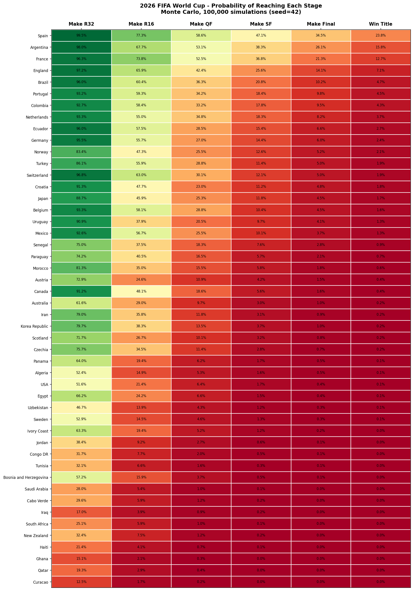

# 2026 World Cup — Simulation Results

**Run on:** Wednesday, June 3, 2026
**What was run:** the whole 2026 World Cup, played out **100,000 times** by computer
**Files in this folder:**

---

## Overview of the results

We let the computer **play the entire tournament 100,000 times**. Each time, the
ball bounces a little differently — favorites sometimes crash out, underdogs
sometimes go on a run — just like real life. Then we simply **count** how often
each team won, reached the final, reached the semifinals, and so on.

If a team won **23,830 out of the 100,000** pretend tournaments, we say it has a
**23.8% chance** to win. That's all a percentage here means: *how often it
happened when we replayed the tournament over and over.*

**Who came out on top this time:**

| | Team | Chance to win the cup |
|---|---|---|
| 🥇 | **Spain** | **23.8%** |
| 🥈 | **Argentina** | **15.8%** |
| 🥉 | **France** | **12.7%** |
| 4 | England | 7.1% |
| 5 | Brazil | 4.7% |
| 6 | Portugal | 4.6% |

Spain came out as the clear favorite, but notice: even the favorite only wins
**about 1 in 4** times. Football is full of surprises, and these numbers are
built to show exactly that. Just three teams (Spain, Argentina, France) account
for **more than half** of all simulated championships — the other ~47% is spread
across the remaining 45 teams.

> **Important:** this is **not a prediction** that Spain *will* win. It's a way of
> saying, "based on how strong each team is on paper, here's how often each
> outcome happened when we replayed the tournament 100,000 times."

---

## What is "Monte Carlo"?

Imagine you want to know how often you'd roll a 7 with two dice. You *could* do
the math — or you could just **roll the dice a thousand times and count**. That
counting approach is called a **Monte Carlo simulation** (named after the famous
casino). It's a fancy term for a simple idea:

> **Try the same thing many times with a bit of randomness, then count what happened.**

One single pretend tournament tells us almost nothing — maybe the best team got
unlucky in a penalty shootout and went home early. But replay it **100,000
times** and it leaves a stable, trustworthy pattern. The more
times we replay, the steadier the numbers get.

**Why 100,000 replays?** More replays = smoother, more reliable numbers. At
100,000 the results barely wiggle, so you can trust them to a few hundredths of a
percent.

---

## How to read the heatmap

Think of it as a big scoreboard. **Each row is a team**, listed from the most
likely champion (top) to the least likely (bottom).

**Each column is a checkpoint** the team is trying to reach, getting harder as
you move right:

- **Make R32** → survive the group stage and reach the Round of 32
- **Make R16** → reach the Round of 16 (last 16 teams)
- **Make QF** → reach the Quarterfinals (last 8)
- **Make SF** → reach the Semifinals (last 4)
- **Make Final** → reach the Final (last 2)
- **Win Title** → win the whole thing

**Each colored box shows the percentage chance** that the team reaches *at least*
that checkpoint. The color is just a quick visual cue for that number:

- 🟢 **Green = very likely** (a high percentage)
- 🟡 **Yellow = a coin flip** (around 50/50)
- 🔴 **Red = unlikely** (a low percentage)

**Two quick tricks for reading it:**

1. **Read a row left-to-right** and the numbers only ever *shrink*. That's
   expected — it's harder to reach the final than the quarterfinals, and harder
   still to win it all. A team's row going from green to red shows where its
   journey usually ends.
2. **Scan a column top-to-bottom** to compare every team at one checkpoint. The
   "Win Title" column on the far right is the headline: the green at the top fades
   to deep red at the bottom, showing how the title race is concentrated among a
   handful of teams.

For example, Spain's row is almost entirely green and fades only at the very
end — it nearly always advances deep, and wins the title 23.8% of the time. A
team near the bottom, like Curacao, is green only in the first column (it
sometimes escapes its group) and red everywhere after — it essentially never goes
the distance in these simulations.

---

## The full results (all 48 teams)

Every percentage is the chance of reaching **at least** that stage. Open
`wc2026_probabilities.csv` to sort or chart these yourself.

| Rank | Team | Elo | Make R32 | Make R16 | Make QF | Make SF | Make Final | Win Title |
|---|---|---|---|---|---|---|---|---|
| 1 | Spain | 2165 | 99.5% | 77.3% | 58.6% | 47.1% | 34.5% | 23.8% |
| 2 | Argentina | 2113 | 98.0% | 67.7% | 53.1% | 38.3% | 26.1% | 15.8% |
| 3 | France | 2081 | 96.3% | 73.8% | 52.5% | 36.8% | 21.3% | 12.7% |
| 4 | England | 2020 | 97.2% | 65.9% | 42.4% | 25.6% | 14.1% | 7.1% |
| 5 | Brazil | 1988 | 96.0% | 60.4% | 36.3% | 20.8% | 10.2% | 4.7% |
| 6 | Portugal | 1984 | 93.2% | 59.3% | 34.2% | 18.4% | 9.8% | 4.6% |
| 7 | Colombia | 1977 | 92.7% | 58.4% | 33.2% | 17.8% | 9.5% | 4.3% |
| 8 | Netherlands | 1961 | 93.3% | 55.0% | 34.8% | 18.3% | 8.2% | 3.7% |
| 9 | Ecuador | 1935 | 96.0% | 57.5% | 28.5% | 15.4% | 6.6% | 2.7% |
| 10 | Germany | 1925 | 95.5% | 55.7% | 27.0% | 14.4% | 6.0% | 2.4% |
| 11 | Norway | 1917 | 83.4% | 47.3% | 25.5% | 12.6% | 5.2% | 2.1% |
| 12 | Turkey | 1906 | 86.1% | 55.9% | 28.8% | 11.4% | 5.0% | 1.9% |
| 13 | Switzerland | 1894 | 96.8% | 63.0% | 30.1% | 12.1% | 5.0% | 1.9% |
| 14 | Croatia | 1908 | 91.3% | 47.7% | 23.0% | 11.2% | 4.8% | 1.8% |
| 15 | Japan | 1906 | 88.7% | 45.9% | 25.3% | 11.8% | 4.5% | 1.7% |
| 16 | Belgium | 1888 | 93.3% | 58.1% | 28.8% | 10.4% | 4.5% | 1.6% |
| 17 | Uruguay | 1892 | 90.9% | 37.9% | 20.5% | 9.7% | 4.1% | 1.3% |
| 18 | Mexico | 1867 | 92.6% | 56.7% | 25.5% | 10.1% | 3.7% | 1.3% |
| 19 | Senegal | 1867 | 75.0% | 37.5% | 18.3% | 7.6% | 2.8% | 0.9% |
| 20 | Paraguay | 1832 | 74.2% | 40.5% | 16.5% | 5.7% | 2.1% | 0.7% |
| 21 | Morocco | 1824 | 81.3% | 35.0% | 15.5% | 5.8% | 1.8% | 0.6% |
| 22 | Austria | 1830 | 72.9% | 24.6% | 10.9% | 4.2% | 1.5% | 0.4% |
| 23 | Canada | 1793 | 91.2% | 48.1% | 18.6% | 5.6% | 1.6% | 0.4% |
| 24 | Australia | 1774 | 61.6% | 29.0% | 9.7% | 3.0% | 1.0% | 0.2% |
| 25 | Iran | 1764 | 79.0% | 35.8% | 11.8% | 3.1% | 0.9% | 0.2% |
| 26 | Korea Republic | 1756 | 79.7% | 38.3% | 13.5% | 3.7% | 1.0% | 0.2% |
| 27 | Scotland | 1770 | 71.7% | 26.7% | 10.1% | 3.2% | 0.8% | 0.2% |
| 28 | Czechia | 1733 | 75.7% | 34.5% | 11.4% | 2.8% | 0.7% | 0.2% |
| 29 | Panama | 1733 | 64.0% | 19.4% | 6.2% | 1.7% | 0.5% | 0.1% |
| 30 | Algeria | 1743 | 52.4% | 14.9% | 5.3% | 1.6% | 0.5% | 0.1% |
| 31 | USA | 1733 | 51.6% | 21.4% | 6.4% | 1.7% | 0.4% | 0.1% |
| 32 | Egypt | 1699 | 66.2% | 24.2% | 6.6% | 1.5% | 0.4% | 0.1% |
| 33 | Uzbekistan | 1718 | 46.7% | 13.9% | 4.3% | 1.2% | 0.3% | 0.1% |
| 34 | Sweden | 1714 | 52.9% | 14.5% | 4.6% | 1.3% | 0.3% | 0.1% |
| 35 | Ivory Coast | 1676 | 63.3% | 19.4% | 5.2% | 1.2% | 0.2% | 0.0% |
| 36 | Jordan | 1685 | 38.4% | 9.2% | 2.7% | 0.6% | 0.1% | 0.0% |
| 37 | Congo DR | 1655 | 31.7% | 7.7% | 2.0% | 0.5% | 0.1% | 0.0% |
| 38 | Tunisia | 1633 | 32.1% | 6.6% | 1.6% | 0.3% | 0.1% | 0.0% |
| 39 | Bosnia and Herzegovina | 1591 | 57.2% | 15.9% | 3.7% | 0.5% | 0.1% | 0.0% |
| 40 | Saudi Arabia | 1566 | 28.0% | 5.4% | 1.0% | 0.1% | 0.0% | 0.0% |
| 41 | Cabo Verde | 1576 | 29.6% | 5.9% | 1.2% | 0.2% | 0.0% | 0.0% |
| 42 | Iraq | 1608 | 17.0% | 3.9% | 0.9% | 0.2% | 0.0% | 0.0% |
| 43 | South Africa | 1518 | 25.1% | 5.9% | 1.0% | 0.1% | 0.0% | 0.0% |
| 44 | New Zealand | 1563 | 32.4% | 7.5% | 1.2% | 0.2% | 0.0% | 0.0% |
| 45 | Haiti | 1554 | 21.4% | 4.1% | 0.7% | 0.1% | 0.0% | 0.0% |
| 46 | Ghana | 1510 | 15.1% | 2.1% | 0.3% | 0.0% | 0.0% | 0.0% |
| 47 | Qatar | 1423 | 19.3% | 2.9% | 0.4% | 0.0% | 0.0% | 0.0% |
| 48 | Curacao | 1433 | 12.5% | 1.7% | 0.2% | 0.0% | 0.0% | 0.0% |

*(A "0.0%" doesn't mean strictly impossible — it means it happened in fewer than
about 1 in 2,000 of the simulated tournaments, so it rounds to zero.)*

---

## A few honest caveats

This is a fun, transparent model — not a crystal ball. Keep in mind:

- **It's not a prediction.** It shows how often things happened in a simplified
  replay, given each team's strength on paper.
- **Team strengths are approximate.** Each team's "Elo" rating (the strength
  number) is a reasonable but illustrative estimate, not an official figure.
- **Real-life factors aren't modeled** — injuries, current form, weather, red
  cards, home advantage, travel, or tactical matchups.
- **The numbers are repeatable on purpose.** The simulation starts its "dice"
  from the same place every run (a fixed *random seed*), so anyone who re-runs it
  gets these exact percentages. The drama still happens *inside* the 100,000
  replays — the seed just makes the final scoreboard stable and checkable.

A good way to hold it in your head:

> *"Given these team strengths, the official 2026 groups, and a simplified match
> model, here's how often each team reached each stage across 100,000 replays."*

For the full methodology (how matches, groups, and the knockout bracket are
simulated), see the main project [README](../README.md).
